Gene Activation Analysis: Benchmark of NB-act
================

# Introduction:

This analysis explores the performance of nb-act method for detecting
activation outliers, that is, genes that are usually inactive in most of
the samples (very low expression) and become active in a few samples
(high expression).

For benchmarking purposes, the method will be applied to the activation
of Y-chr genes in males. Idea: genes located in the Y-chromosome are
expressed in males but not in females. NB-act should identify as
activation outliers Y-chr genes in the male samples (= positives), but
not the female samples (= negative).

This idea will be applied to GTEx dataset (Whole Blood, Fibroblast,
Brain) and Munich Leukemia Laboratory (MLL).

# GTEx Whole Blood:

## Load libraries, data and functions:

``` r
library(dplyr)
library(SummarizedExperiment)
library(tibble)
library(tidyr)
library(ggplot2)
library(patchwork)
```

``` r
source("/data/nasif12/home_if12/l_araiz/workspace/gene_activation/scripts/function/plots_functions.R")
source("/data/nasif12/home_if12/l_araiz/workspace/gene_activation/scripts/function/help_functions.R")
source("/data/nasif12/home_if12/l_araiz/workspace/gene_activation/scripts/function/nb_act.R")
```

Input is the outrider object containing counts, sample and gene
information (sex, size factors, gene_length, etc.).

The list of Y-chr genes is used to determine which genes are expected to
be activated.

``` r
# Load outrider object
WB <- readRDS("/data/ceph/hdd/project/node_05/gtex_genetic_diagnosis/v8/processed_results/aberrant_expression/gencode34/outrider/Whole_Blood/ods.Rds")

# Load y chromosome genes
y_chr <- read.table("/data/nasif12/home_if12/l_araiz/workspace/gene_act/data/Y_chr_genes.tsv", 
                             sep = "\t", header = TRUE, quote = "", fill = TRUE)

rownames(y_chr) <- y_chr$Gene.stable.ID
```

## Pre-processing:

Select a subset of 95% of females and 5% of males to ensure that Y-chr
genes appear as rarely expressed.

``` r
# Select Subset
subset_counts_FB <- subsetRandom(WB, num_males = 10, num_females = 240)
```

Convert counts in RPKM and apply outrider criteria: \> 1 RPKM in \< 5%
of the samples are Rarely Expressed

``` r
# Filter for rarely expressed
rare_WB <- filterRarely(WB, subset_counts = subset_counts_FB)
```

    ## count matrix has 12533 genes and 250 samples

    ## rpkm matrix has 12533 genes and 250 samples

    ## There are 45 RE genes

    ##                    GTEX-113JC-0006-SM-5O997 GTEX-12WSD-0005-SM-5N9FZ
    ## ENSG00000012817.15                        4                        6
    ## ENSG00000049759.18                      130                      222
    ## ENSG00000067048.17                        9                        6
    ## ENSG00000086967.10                        8                       11
    ## ENSG00000099725.14                        1                       13
    ##                    GTEX-15DCD-0006-SM-7RHG4 GTEX-1HCUA-0006-SM-ACKV9
    ## ENSG00000012817.15                        5                        5
    ## ENSG00000049759.18                      209                      140
    ## ENSG00000067048.17                        7                        4
    ## ENSG00000086967.10                        0                        9
    ## ENSG00000099725.14                        3                        5
    ##                    GTEX-15DYW-0006-SM-7RHFR
    ## ENSG00000012817.15                        3
    ## ENSG00000049759.18                      192
    ## ENSG00000067048.17                        5
    ## ENSG00000086967.10                      133
    ## ENSG00000099725.14                       14

## Run NB-act

Run NB-act method on the subset of rarely expressed genes with the
original parameters (as published in the paper). The formula for the
expected counts has been modified to recover values in the scale of raw
counts. Using size factors AND the median for library size.

``` r
results_WB <- nb_act(WB, rare_WB$rarely_exp_rpkm, adj = "BH", threshold = 1, theta = 0.02)
```

    ## Summary:

    ## Total outliers (padj or pval < 0.05): 0

    ## Observed > Expected: 552

    ## Genes with some outlier: 0

    ## Samples with some outlier: 0

    ## Median of outliers per gene: 0

    ## Median of outliers per sample: 0

With the corrected equation and the original parameters, no significant
outlier is found. Main goal is to find the optimal values for threshold
and theta parameters.

## Parameter exploration

For this purpose, we will use the exploreParams function that includes:

1.  Run nb-act will be run with different parameter combinations.

2.  Convert gene x sample matrix to long format (Gene, Sample ID,
    Pvalue) and add a column for sex and another one indicating if they
    belong to chromosome Y.

3.  Rank genes according to p-value.

4.  Add a column of “positives” if the gene x sample belongs to the Y -
    chr AND a male sample.

5.  Add a column with the cumulative sum of positive genes (those that
    belong to Y-chr in males)

6.  Plot index vs cumulative sum for the different parameters

7.  Record at which position half of the positives is achieved (N50) for
    a given threshold, theta.

``` r
# Parameter values to test 
threshold_vals <- c(0.1, 1, 5, 10, 50, 100)
theta_vals <- c(0.1, 1, 10, 100)

# IDs of male samples
male_ID <- rownames(colData(WB)[which(colData(WB)$SEX == "Male"),])

# Results long is not adjusted
results_long_all_WB <- exploreParams(WB, rare_WB$rarely_exp_rpkm, theta_vals = theta_vals,
              threshold_vals = threshold_vals, interest_list = y_chr$Gene.stable.ID, male_ID = male_ID)
```

``` r
# Plot only male samples (Y-chr in female sample)
curvePlot(results_long_all_WB$results_long_all, title = "Cumulative sum of y-chr genes",
          only_male = TRUE, male_ID = male_ID)
```

<!-- -->

As the resolution of this plot is not good enough to distinguish between
the different parameter combinations, let’s do the same with all males
instead of just one subset.

For this purpose, we use the same rarely expressed genes that were
define previously (45 genes), but we run NB-act on all samples.

``` r
counts_WB <- assays(WB)$counts
rare_all_samples <- counts_WB[rare_WB$rarely_exp_genes,]
print(dim(rare_all_samples))
```

    ## [1]  45 735

``` r
# Results long is not adjusted
results_long_all_WB <- exploreParams(WB, rare_all_samples, theta_vals = theta_vals,
              threshold_vals = threshold_vals, interest_list = y_chr$Gene.stable.ID, male_ID = male_ID)
```

``` r
curvePlot(results_long_all_WB$results_long_all, title = "Cumulative sum of y-chr genes",
          only_male = TRUE, male_ID = male_ID)
```

<!-- --> A low
value of threshold (0.1 RPKM, less strict) and a high value of
dispersion (100, less strict) appear to work better (orange lines).

Let’s take a look at the N50 for each curve (position in which half of
the positives is achieved)

``` r
n50Plot(results_long_all_WB, plot_type = "line")
```

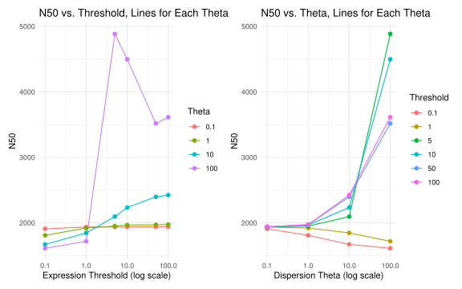<!-- -->

Again, low threshold and high variance appear to be better.

# GTEx Fibroblast:

Let’s try another tissue (Fibroblast), because there is higher number of
expressed Y-chr genes (in WB only 6) and to see if we observe the same
tendency in terms of the parameters.

## Load data

``` r
FB <- readRDS("/data/ceph/hdd/project/node_05/gtex_genetic_diagnosis/v8/processed_results/aberrant_expression/gencode34/outrider/Cells_-_Cultured_fibroblasts/ods.Rds")
```

Select subset (4% males) and filter for rarely expressed genes.

``` r
# Select Subset
subset_counts_FB <- subsetRandom(FB, num_males = 7, num_females = 168)
```

    ## Resulting count matrix has 16083 genes and 175 samples

``` r
# Filter for rarely expressed
rare_FB <- filterRarely(FB, subset_counts = subset_counts_FB)
```

    ## count matrix has 16083 genes and 175 samples

    ## rpkm matrix has 16083 genes and 175 samples

    ## There are 82 RE genes

    ##                    GTEX-WWYW-0008-SM-4MVPF GTEX-ZPCL-0008-SM-4WWAU
    ## ENSG00000010610.10                      27                      57
    ## ENSG00000012817.15                       8                       4
    ## ENSG00000044524.11                     200                      52
    ## ENSG00000067048.17                       5                       3
    ## ENSG00000067646.12                       0                       0
    ##                    GTEX-1AMFI-0008-SM-EVYAV GTEX-14PKV-0008-SM-E9U4H
    ## ENSG00000010610.10                       12                      265
    ## ENSG00000012817.15                        4                        5
    ## ENSG00000044524.11                       43                      336
    ## ENSG00000067048.17                        6                        3
    ## ENSG00000067646.12                        2                        3
    ##                    GTEX-SE5C-0008-SM-4B64J
    ## ENSG00000010610.10                      15
    ## ENSG00000012817.15                      15
    ## ENSG00000044524.11                      20
    ## ENSG00000067048.17                       8
    ## ENSG00000067646.12                       1

## Explore parameters

``` r
# Parameter values to test 
threshold_vals <- c(0.1, 1, 5, 10, 50, 100)
theta_vals <- c(0.1, 1, 10, 100)

# IDs of male samples
male_ID <- rownames(colData(FB)[which(colData(FB)$SEX == "Male"),])

# Results long is not adjusted
results_long_all_FB <- exploreParams(FB, rare_FB$rarely_exp_rpkm, theta_vals = theta_vals,
              threshold_vals = threshold_vals, interest_list = y_chr$Gene.stable.ID, male_ID = male_ID)
```

``` r
curvePlot(results_long_all_FB$results_long_all, title = "Cumulative sum of y-chr genes",
          only_male = TRUE, male_ID = male_ID)
```

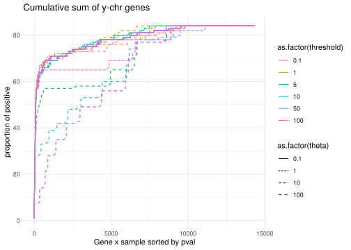<!-- -->

Same idea as before, not enough resolution. Let’s do it with all males.

``` r
counts_FB <- assays(FB)$counts
rare_all_samples_FB <- counts_FB[rare_FB$rarely_exp_genes,]
print(dim(rare_all_samples_FB))
```

    ## [1]  82 492

``` r
# Results long is not adjusted
results_long_all_FB <- exploreParams(FB, rare_all_samples_FB, theta_vals = theta_vals,
              threshold_vals = threshold_vals, interest_list = y_chr$Gene.stable.ID, male_ID = male_ID)
```

``` r
curvePlot(results_long_all_FB$results_long_all, title = "Cumulative sum of y-chr genes")
```

<!-- -->

No big difference can be observed. In general, too high variance is not
good. Lower threshold (less conservative) and higher dispersion (less
conservative) is better.

``` r
n50Plot(results_long_all_FB, plot_type = "line")
```

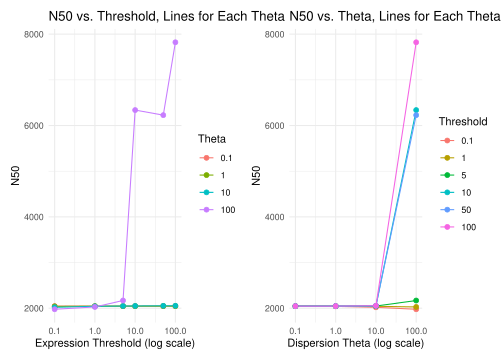<!-- -->

# GTEx Brain

Let’s do the same with one more tissue (Brain)

## Load data

``` r
# Load outrider object
BR <- readRDS("/data/ceph/hdd/project/node_05/gtex_genetic_diagnosis/v8/processed_results/aberrant_expression/gencode34/outrider/Brain_-_Cortex/ods.Rds")
```

## Pre-processing:

Subset (4% males) and filter for NB-act.

``` r
# Select Subset
subset_counts_BR <- subsetRandom(BR, num_males = 3, num_females = 67)
```

    ## Resulting count matrix has 17490 genes and 70 samples

``` r
# Filter for rarely expressed
rare_BR <- filterRarely(BR, subset_counts = subset_counts_BR)
```

    ## count matrix has 17490 genes and 70 samples

    ## rpkm matrix has 17490 genes and 70 samples

    ## There are 97 RE genes

    ##                    GTEX-14PJM-3126-SM-6EU2R GTEX-14DAQ-3126-SM-62LDS
    ## ENSG00000010310.9                        35                       46
    ## ENSG00000012817.15                        0                        4
    ## ENSG00000039068.19                       47                      349
    ## ENSG00000067048.17                        3                        4
    ## ENSG00000067646.12                        0                        0
    ##                    GTEX-14A5I-2926-SM-5Q5CQ GTEX-1H2FU-3126-SM-9WYUJ
    ## ENSG00000010310.9                        26                        8
    ## ENSG00000012817.15                        3                        1
    ## ENSG00000039068.19                       49                       35
    ## ENSG00000067048.17                        4                        5
    ## ENSG00000067646.12                        0                        0
    ##                    GTEX-ZAK1-3026-SM-5S2MJ
    ## ENSG00000010310.9                       31
    ## ENSG00000012817.15                       5
    ## ENSG00000039068.19                      53
    ## ENSG00000067048.17                       2
    ## ENSG00000067646.12                       0

## Explore parameters

``` r
# IDs of male samples
male_ID <- rownames(colData(BR)[which(colData(BR)$SEX == "Male"),])

counts_BR <- assays(BR)$counts
rare_all_samples_BR <- counts_BR[rare_BR$rarely_exp_genes,]
print(dim(rare_all_samples_BR))


# Results long is not adjusted
results_long_all_BR <- exploreParams(BR, rare_all_samples_BR, theta_vals = theta_vals,
              threshold_vals = threshold_vals, interest_list = y_chr$Gene.stable.ID, male_ID = male_ID)
```

``` r
curvePlot(results_long_all_BR$results_long_all, title = "Cumulative sum of y-chr genes",
          only_male = TRUE, male_ID = male_ID)
```

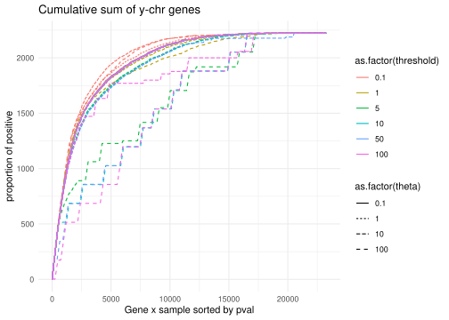<!-- -->

``` r
curvePlot(results_long_all_BR$results_long_all, title = "Cumulative sum of y-chr genes")
```

<!-- -->

0.1 RPKM and 10 dispersion appear to work better.

``` r
n50Plot(results_long_all_BR, plot_type = "line")
```

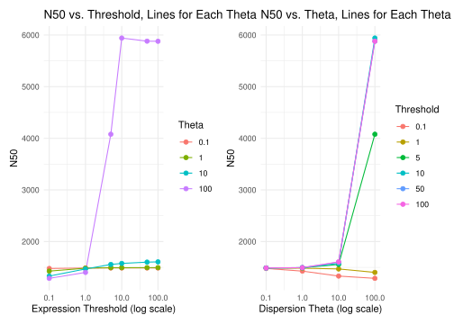<!-- -->

# Munich Leukemia Laboratory:

This is a different dataset, containing blood samples of pacients with
leukemia.

## Load data

``` r
MLL <- readRDS("/s/project/mll/drop_2023feb/processed_results/aberrant_expression/v33b/outrider/leukemia_14group/ods_unfitted.Rds")
MLL <- estimateSizeFactors(MLL)
```

## Pre-processing

``` r
# Select Subset
groups <- c("Gender", "2", "1")
subset_counts_MLL <- subsetRandom(MLL, num_males = 32, num_females = 785, groups = groups)
```

    ## Resulting count matrix has 20084 genes and 817 samples

``` r
#Filter for rarely expressed genes (around 6000)
rare_MLL <- filterRarely(MLL, subset_counts = subset_counts_MLL)
```

    ## count matrix has 20084 genes and 817 samples

    ## rpkm matrix has 20084 genes and 817 samples

    ## There are 6422 RE genes

    ##                            MLL_11148 MLL_21264 MLL_14492 MLL_12427 MLL_32245
    ## ENSG00000000003.15_4              23        13        19         9         4
    ## ENSG00000000005.6_3                1         0         0         0         0
    ## ENSG00000001626.16_8               0         0         0         0         0
    ## ENSG00000002586.20_6_PAR_Y         0         0         0         0         0
    ## ENSG00000002587.10_6              15        14         3         5         8

## Explore Parameters:

``` r
male_ID <- rownames(colData(MLL)[which(colData(MLL)$Gender == "2"),])

results_long_all_MLL <- exploreParams(MLL, rare_MLL$rarely_exp_rpkm, theta_vals = theta_vals, threshold_vals = threshold_vals, interest_list = y_chr$Gene.stable.ID, male_ID = male_ID, too_large = TRUE)
```

``` r
curvePlot(results_long_all_MLL$results_long_all, title = "Cumulative sum of y-chr genes",
          only_male = TRUE, male_ID = male_ID)
```

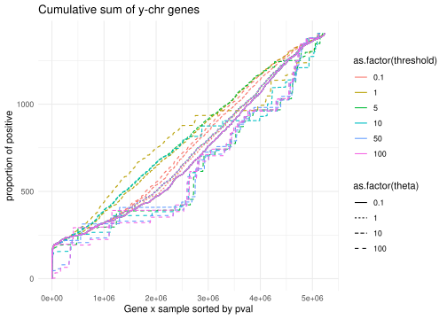<!-- -->

This looks a bit weird, let’s apply a filter for differential expressed
genes. The idea is to expect activation (positives) only in those genes
that are significantly differentially expressed in males vs females
(padj \< 0.05 and LFC \> 2)

``` r
dif_res <- read.table("/data/nasif12/home_if12/l_araiz/workspace/gene_act/data/dif_res_MLL.tsv")

up_genes_male <- dif_res[which(dif_res$padj < 0.05 & dif_res$log2FoldChange > 2), ]

# Check how many are in Y_chr
y_dif <- up_genes_male[which(sub("\\..*", "", rownames(up_genes_male)) %in% sub("\\..*", "", y_chr$Gene.stable.ID)),]


y_dif_genes <- rownames(y_dif)
```

``` r
results_long_all_MLL <- exploreParams(MLL, rare_MLL$rarely_exp_rpkm, theta_vals = theta_vals, threshold_vals = threshold_vals, interest_list = y_dif_genes, male_ID = male_ID, too_large = TRUE)
```

``` r
curvePlot(results_long_all_MLL$results_long_all, title = "Cumulative sum of y-chr genes",
          only_male = TRUE, male_ID = male_ID)
```

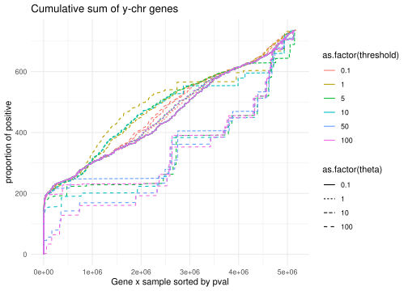<!-- -->

``` r
n50Plot(results_long_all_MLL, plot_type = "line")
```

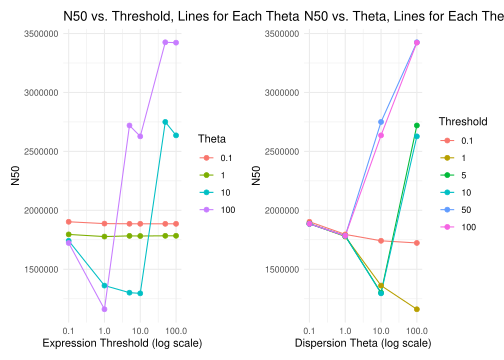<!-- -->

Here 1 (more conservative) and 100 (less conservative) appear to be a
bit better.

# Let’s try without the too_large TRUE

``` r
results_long_all_MLL <- exploreParams(MLL, rare_MLL$rarely_exp_rpkm, theta_vals = theta_vals, threshold_vals = threshold_vals, interest_list = y_chr$Gene.stable.ID, male_ID = male_ID)
```

``` r
sampled_data <- results_long_all_MLL$results_long_all[sample(nrow(results_long_all_MLL$results_long_all), 1000000), ]
curvePlot(sampled_data, title = "Cumulative sum of y-chr genes",
          only_male = TRUE, male_ID = male_ID)
```

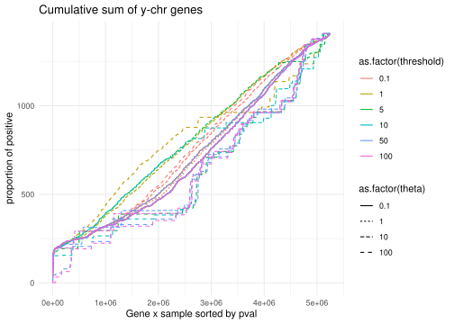<!-- -->

``` r
curvePlot(sampled_data, title = "Cumulative sum of y-chr genes")
```

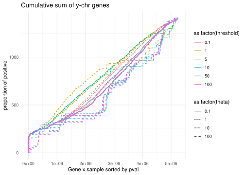<!-- -->

``` r
n50Plot(results_long_all_MLL, plot_type = "line")
```

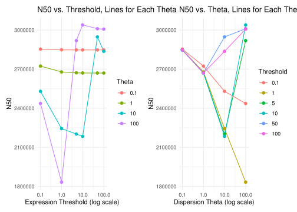<!-- -->

# CONCLUSION:

In general, when ranking gene x sample according to p-value, Y-chr genes
in males appear in the first positions (as expected). It works better in
GTEx than in MLL, probably because there are other genes that are
activated (such as oncogenes or cancer related genes).

Optimal parameter combinations: 0.1 - 10 (GTEx, across all tissues) or
1 - 100 (MLL), but ranking appears to work pretty well with all of them.
