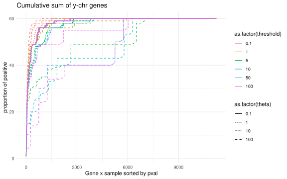

Gene Activation Analysis: Benchmark of NB-act
================

## Introduction:

This analysis explores the performance of nb-act method for detecting
activation outliers, that is, genes that are usually inactive in most of
the samples (very low expression) and become active in a few samples
(high expression).

For benchmarking purposes, the method will be applied to the activation
of Y-chr genes in males. Idea: genes located in the Y-chromosome are
expressed in males but not in females. NB-act should identify as
activation outliers Y-chr genes in the male samples (= positives), but
not the female samples (= negative).

This idea will be applied to GTEx dataset (Whole Blood, Fibroblast,
Brain) and Munich Leukemia Laboratory (MLL).

# Load libraries:

``` r
library(dplyr)
library(SummarizedExperiment)
library(tibble)
library(tidyr)
library(ggplot2)
```

# Load functions:

``` r
source("/data/nasif12/home_if12/l_araiz/workspace/gene_activation/scripts/function/plots_functions.R")
source("/data/nasif12/home_if12/l_araiz/workspace/gene_activation/scripts/function/help_functions.R")
source("/data/nasif12/home_if12/l_araiz/workspace/gene_activation/scripts/function/nb_act.R")
```

# Load data:

Input is the outrider object containing counts, sample and gene
information (sex, size factors, gene_length, etc.).

The list of Y-chr genes is used to determine which genes are expected to
be activated.

``` r
# Load outrider object
WB <- readRDS("/data/ceph/hdd/project/node_05/gtex_genetic_diagnosis/v8/processed_results/aberrant_expression/gencode34/outrider/Whole_Blood/ods.Rds")

# Load y chromosome genes
y_chr <- read.table("/data/nasif12/home_if12/l_araiz/workspace/gene_act/data/Y_chr_genes.tsv", 
                             sep = "\t", header = TRUE, quote = "", fill = TRUE)

rownames(y_chr) <- y_chr$Gene.stable.ID
```

# Pre-processing:

Select a subset of 95% of females and 5% of males to ensure that Y-chr
genes appear as rarely expressed.

``` r
# Select Subset
subset_counts_FB <- subsetRandom(WB, num_males = 10, num_females = 240)
```

Convert counts in RPKM and apply outrider criteria: \> 1 RPKM in \< 5%
of the samples are Rarely Expressed

``` r
# Filter for rarely expressed
rare_WB <- filterRarely(WB, subset_counts = subset_counts_FB)
```

    ## count matrix has 12533 genes and 250 samples

    ## rpkm matrix has 12533 genes and 250 samples

    ## There are 45 RE genes

    ##                    GTEX-113JC-0006-SM-5O997 GTEX-12WSD-0005-SM-5N9FZ
    ## ENSG00000012817.15                        4                        6
    ## ENSG00000049759.18                      130                      222
    ## ENSG00000067048.17                        9                        6
    ## ENSG00000086967.10                        8                       11
    ## ENSG00000099725.14                        1                       13
    ##                    GTEX-15DCD-0006-SM-7RHG4 GTEX-1HCUA-0006-SM-ACKV9
    ## ENSG00000012817.15                        5                        5
    ## ENSG00000049759.18                      209                      140
    ## ENSG00000067048.17                        7                        4
    ## ENSG00000086967.10                        0                        9
    ## ENSG00000099725.14                        3                        5
    ##                    GTEX-15DYW-0006-SM-7RHFR
    ## ENSG00000012817.15                        3
    ## ENSG00000049759.18                      192
    ## ENSG00000067048.17                        5
    ## ENSG00000086967.10                      133
    ## ENSG00000099725.14                       14

# Run NB-act

Run NB-act method on the subset of rarely expressed genes with the
original parameters (as published in the paper). The formula for the
expected counts has been modified to recover values in the scale of raw
counts. Using size factors AND the median for library size.

``` r
results_WB <- nb_act(WB, rare_WB$rarely_exp_rpkm, adj = "BH", threshold = 1, theta = 0.02)
```

    ## Summary:

    ## Total outliers (padj or pval < 0.05): 0

    ## Observed > Expected: 552

    ## Genes with some outlier: 0

    ## Samples with some outlier: 0

    ## Median of outliers per gene: 0

    ## Median of outliers per sample: 0

With the corrected equation and the original parameters, no significant
outlier is found. Main goal is to find the optimal values for threshold
and theta parameters.

For this purpose, we will use the exploreParams function that
includes: 1. Run nb-act will be run with different parameter
combinations. 2. Convert gene x sample matrix to long format (Gene,
Sample ID, Pvalue) and add a column for sex. 3. Rank genes according to
p-value. 4. Add a column with the cumulative sum of positive genes
(those that belong to Y-chr) 5. Plot index vs cumulative sum for the
different parameters 6. Record at which position half of the positives
is achieved (N50) for a given threshold, theta.

``` r
# Parameter values to test 
threshold_vals <- c(0.1, 1, 5, 10, 50, 100)
theta_vals <- c(0.1, 1, 10, 100)

# IDs of male samples
male_ID <- rownames(colData(WB)[which(colData(WB)$SEX == "Male"),])

# Results long is not adjusted
results_long_all_WB <- exploreParams(WB, rare_WB$rarely_exp_rpkm, theta_vals = theta_vals,
              threshold_vals = threshold_vals, interest_list = y_chr$Gene.stable.ID, male_ID = male_ID)
```

``` r
# Plot only male samples (Y-chr in female sample)
curvePlot(results_long_all_WB$results_long_all, title = "Cumulative sum of y-chr genes",
          only_male = TRUE, male_ID = male_ID)
```

<!-- -->
